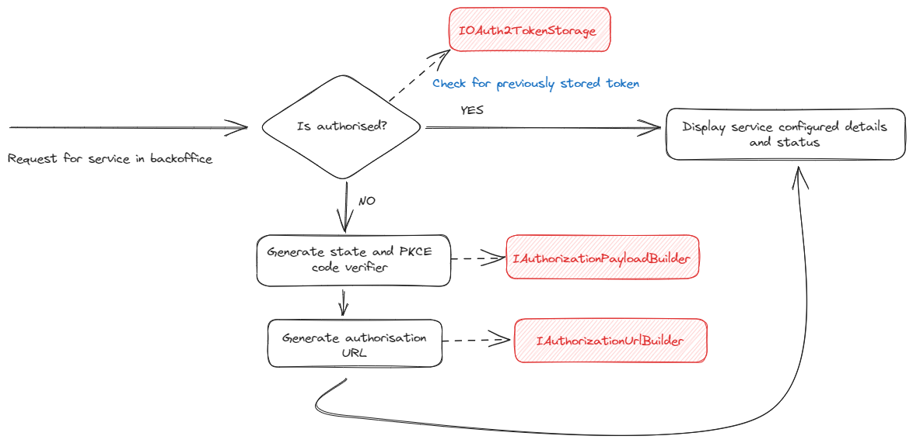
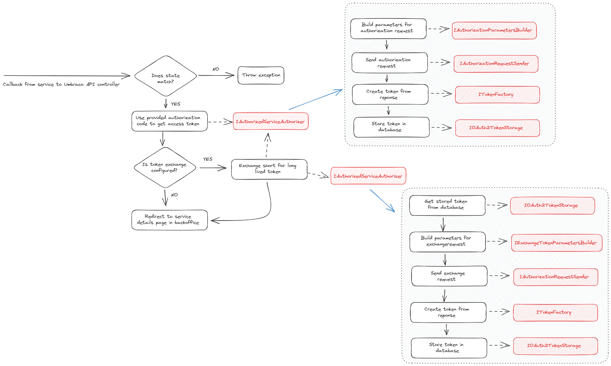
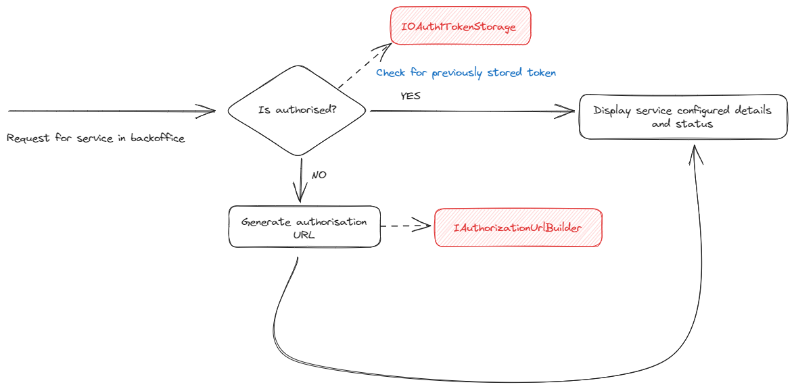
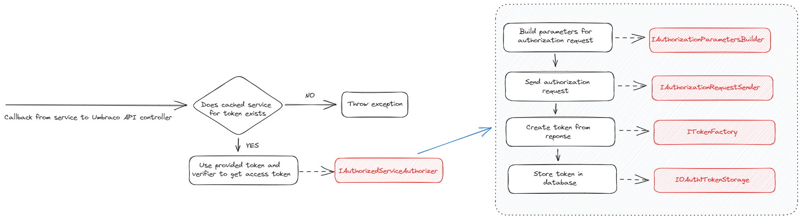
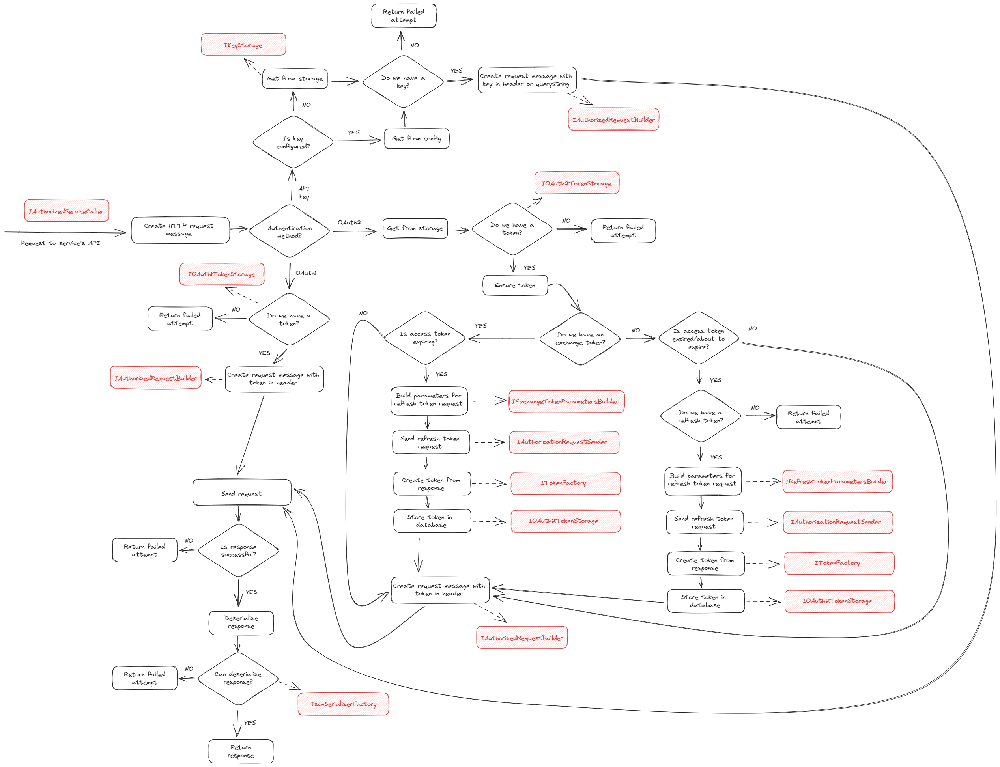

# Umbraco Authorized Services [](https://www.nuget.org/packages/Umbraco.AuthorizedServices) [](https://www.nuget.org/packages/Umbraco.AuthorizedServices) [](https://marketplace.umbraco.com/package/umbraco.authorizedservices)

## Aims

**Umbraco Authorized Services** is an Umbraco package designed to reduce the effort needed to integrate third party services that require authentication and authorization via an OAuth or API key based flow into Umbraco solutions.  It's based on the premise that working with these services requires a fair bit of plumbing code to handle creating an authorized connection.  This is necessary before the developer working with the service can get to actually using the provided API to implement the business requirements.

Having worked with a few OAuth integrations across different providers, as would be expected, there are quite a few similarities to the flow that needs to be implemented.  Steps include:

- Redirecting to an authentication endpoint.
- Handling the response including an authentication code (or an oauth token and verifier code) and exchanging it for an access token.
- Securely storing the token.
- Including the token in API requests.
- Serializing requests and deserializing the API responses.
- Handling cases where the token has expired and obtaining a new one via a refresh token.

With API key based flows, the process is a little simpler.  But you still have to consider secure storage of the key, providing it correctly in API calls and handling serialization tasks.

There are though also differences, across request and response structures and variations in the details of the flow itself.

The idea of the package is to try to implement a single, best practice implementation of working with OAuth that can be customized, via configuration or code, for particular providers.

## Features

For the solution developer, the Umbraco Authorized Services offers two primary features.

Firstly there's an tree available in the _Settings_ section of the backoffice, called _Authorized Services_. The tree shows the list of services based on the details provided in configuration.

Each tree entry has a management screen where an administrator can authenticate with an app that has been setup with the service.  The status of each service, in terms of whether the authentication and authorization flow has been completed and an access token (or API key) stored, is shown on this screen.


Secondly, the developer has access to an interface - `IAuthorizedServiceCaller` - that they can inject instances of and use to make authorized requests to the service's API.

## Usage

### Installation

To easily install the package you can use the `Package Manager Console` from Visual Studio, or the `dotnet CLI` tool.

#### Package Manager Console
```
Install-Package Umbraco.AuthorizedServices
```

#### Dotnet CLI
```
dotnet add package Umbraco.AuthorizedServices
```

### App Creation

Services that this package are intended to support will offer an OAuth authentication and authorization flow against an "app" that the developer will need to create with the service.  From this various information will be available, including for example a "client ID" and "client secret" that will need to be applied in configuration.

When creating the app it will usually be necessary to configure a call back URL. You should use the following:

- For OAuth2: `/umbraco/api/AuthorizedServiceResponse/HandleOAuth2IdentityResponse`
- For OAuth1: `/umbraco/api/AuthorizedServiceResponse/HandleOAuth1IdentityResponse`

### Configuring a Service

Details of services available need to be applied to the Umbraco web application's configuration, which, if using the `appSettings.json` file, will look as follows. Other sources such as environment variables can also be used, as per standard .NET configuration.

```json
  "Umbraco": {
    "CMS": {
        ...
    },
    "AuthorizedServices": {
      "TokenEncryptionKey": "",
      "Services": {
        {
          "<serviceAlias>": {
            "DisplayName": "",
            "AuthenticationMethod": "OAuth2AuthorizationCode|OAuth2ClientCredentials|OAuth1|ApiKey",
            "ClientCredentialsProvision": "AuthHeader|RequestBody",
            "ApiHost": "",
            "IdentityHost": "",
            "TokenHost": "",
            "RequestIdentityPath": "",
            "CanManuallyProvideToken": true|false,
            "CanManuallyProvideApiKey": true|false,
            "CanExchangeToken": true|false,
            "ExchangeTokenProvision": {
              "TokenHost": "",
              "RequestTokenPath": "",
              "TokenGrantType": "",
              "RequestRefreshTokenPath": "",
              "RefreshTokenGrantType": "",
              "ExchangeTokenWhenExpiresWithin": ""
            },
            "AuthorizationUrlRequiresRedirectUrl": true|false,
            "RequestTokenPath": "",
            "RequestTokenMethod": "GET|POST",
            "RequestAuthorizationPath": "",
            "JsonSerializer": "Default|JsonNet|SystemTextJson",
            "RequestTokenFormat": "Querystring|FormUrlEncoded",
            "AuthorizationRequestRequiresAuthorizationHeaderWithBasicToken": true|false,
            "ApiKey": "",
            "ApiKeyProvision": {
              "Method": "HttpHeader|QueryString",
              "Key": "",
              "AdditionalParameters": {
              }
            },
            "ClientId": "",
            "ClientSecret": "",
            "UseProofKeyForCodeExchange": true|false,
            "Scopes": "",
            "IncludeScopesInAuthorizationRequest": true|false,
            "AccessTokenResponseKey": "access_token",
            "RefreshTokenResponseKey": "refresh_token",
            "ExpiresInResponseKey": "expires_in",
            "SampleRequest": "",
            "RefreshAccessTokenWhenExpiresWithin": ""
        }
      }
    }
```

#### Configuration Elements

The following section describes each of the configuration elements. An example is provided for one service provider (GitHub).

Not all values are required for all services.  Those that are required are marked with an "*" below.

##### TokenEncryptionKey

Provides an optional key used to encrypt and decrypt tokens when they are saved and retrieved from storage respectively.

If not provided, the value stored in configuration at `Umbraco:CMS:Global:Id` will be used.

##### Services

The collection of services available for authorization and usage structured as a dictionary.

The dictionary key is the alias of the service, which must be unique across the service collection.

The value contains the following elements:

###### DisplayName *

Provides a friendly name for the service used for identification in the user interface.

###### AuthenticationMethod

Specifies the type of authentication the service will use, from one of the following available options: `OAuth1`, `OAuth2AuthorizationCode`, `OAuth2ClientCredentials` or `ApiKey`.

If no value is provided, it will default to `OAuth2AuthorizationCode`.

###### ClientCredentialsProvision

Specifies the available options for providing credentials in an `OAuth2` flow: `AuthHeader` or `RequestBody`.

This setting is only utilized when the `AuthenticatedMethod` value is configured as `OAuth2ClientCredentials`.

###### ApiHost *

The host name for the service API that will be called to deliver business functionality.  E.g. for Github this is `https://api.github.com`.

###### IdentityHost *

The host name for the service's authentication endpoint, used to initiate the authorization of the service by asking the user to login. For GitHub, this is `https://github.com`.

###### TokenHost

Some providers make available a separately hosted service for handling requests for access tokens. If that's the case, it can be provided here. If not provided, the value of `IdentityHost` is used. For GitHub, this is not necessary as the value is `https://github.com`, the same as the identity host.

###### RequestIdentityPath *

Used, along with `IdentityHost` to construct a URL that the user is redirected to when initiating the authorization of the service via the backoffice. For GitHub, the required value is `/login/oauth/authorize`.

###### CanManuallyProvideToken

Specifies whether the service supports generating of tokens via the provider's developer portal such that an administrator can manually add one via the backoffice.

###### CanManuallyProvideApiKey

Specifies whether an administrator can manually add API keys via the backoffice. You might prefer to use this option instead of storing the key in configuration via the `ApiKey` setting.

###### CanExchangeToken

Specifies whether the access token can be exchanged with a long lived one.

###### ExchangeTokenProvision

Provides a strongly typed configuration for a setup that allows exchanging an access token.

This setting is only utilized when `CanExchangeToken` is set to `true`.

The configuration of exchange tokens includes:

- `TokenHost`
- `RequestTokenPath`
- `TokenGrantType`
- `RequestRefreshTokenPath`
- `RefreshTokenGrantType`
- `ExchangeTokenWhenExpiresWithin`

###### AuthorizationUrlRequiresRedirectUrl

Some providers require a redirect URL to be provided with the authentication request. For others, instead it's necessary to configure this as part of the registered app. The default value if not provided via configuration is `false`, which is sufficient for the GitHub example.

###### RequestTokenPath *

Used, along with `TokenHost` to construct a URL used for retrieving access tokens. For GitHub, the required value is `/login/oauth/access_token`.

###### RequestTokenFormat

An enum value that controls how the request to retrieve an access token is formatted. Options are `Querystring` and `FormUrlEncoded`. `Querystring` is the default value and is used for GitHub.

###### RequestAuthorizationPath

Required in `OAuth1` flows for building the service authorization URL.

###### JsonSerializer

An enum value that defines the JSON serializer to use when creating requests and deserializing responses. Options are `Default` and `JsonNet` and `SystemTextJson`.

- `Default` - uses the Umbraco CMS default `IJsonSerializer`.
- `JsonNet` - uses the JSON.Net serializer.
- `SystemTextJson` - uses the System.Text.Json serializer.

###### AuthorizationRequestRequiresAuthorizationHeaderWithBasicToken

This flag indicates whether the basic token should be included in the request for access token. If true, a base64 encoding of <clientId>:<clientSecret> will be added to
the authorization header.

###### API Key

Specifies the key a service with `AuthenticationMethod` set to `ApiKey` will use for making authorized requests to the API.

###### ApiKeyProvision

For `ApiKey` authentication methods, options for passing the API key need to be set, by specifying a method: `HttpHeader` or `QueryString` and the name for the key holding the value.

You can also provide additional parameters that will be included in the querystring or headers via the `AdditionalParameters` dictionary.

###### ClientId *

This value will be retrieved from the registered service app.
For `OAuth1` flows it matches the `consumer key` value from the registered service app.

###### ClientSecret *

This value will be retrieved from the registered service app.  As the name suggests, it should be kept secret and so is probably best not added directly to `appSettings.json` and checked into source control.
For `OAuth1` flows it matches the `consumer secret` value from the registered service app.

###### UseProofKeyForCodeExchange *

This flag will extend the OAuth flow with an additional security layer called [PKCE - Proof Key for Code Exchange](https://auth0.com/docs/get-started/authentication-and-authorization-flow/authorization-code-flow-with-proof-key-for-code-exchange-pkce).

In the OAuth with PKCE flow, a random code will be generated on the client and stored under the name `code_verifier`, and then using the `SHA-256` algorithm it will be hashed under the name `code_challenge`.

When the authorization URL is generated, the `code_challenge` will be sent to the OAuth Server, which will store it. The next request for access token will pass the `code_verifier` as a header key, and the OAuth Server will
compare it with the previously sent `code_challenge`.

###### Scopes *

This value will be configured on the service app and retrieved from there. Best practice is to define only the set of permissions that the integration will need.  For GitHub, the single scope needed to retrieve details about a repository's contributors is `repo`.

###### IncludeScopesInAuthorizationRequest
Specifies whether the provided scopes should be included in the authorization request body (e.g. `Microsoft`).

###### AccessTokenResponseKey

The expected key for retrieving an access token from a response. If not provided the default `access_token` is assumed.

###### RefreshTokenResponseKey

The expected key for retrieving a refresh token from a response. If not provided the default `refresh_token` is assumed.

###### ExpiresInResponseKey

The expected key for retrieving the datetime of token expiry from a response. If not provided the default `expires_in` is assumed.

###### SampleRequest

An optional sample request can be provided, which can be used to check that an authorized service is functioning as expected from the backoffice.  For example, to retrieve the set of contributors to the Umbraco repository hosted at GitHub, this request can be used: `/repos/Umbraco/Umbraco-CMS/contributors`.

###### RefreshAccessTokenWhenExpiresWithin

Specifies a time interval for expiration of access tokens.

### Authorizing a Service

With one or more service configured, it will be available from the items within a tree in the _Settings_ section:

Clicking on an item will show some details about the configured service, and it's authentication status.

If the service is not yet authorized, click the _Authorize Service_ button to trigger the authentication and authorization flow. You will be directed to the service to login, and optionally choose an account.  You will then be asked to agree to the permissions requested by the app. Finally you will be redirect back to the Umbraco backoffice and should see confirmation that an access token has been retrieved and stored such that the service is now authorized. If provided, you can click the _Verify Sample Request_ button to ensure that service's API can be called.

### Calling an Service

To make a call to an authorized service, you first need to obtain an instance of `IAuthorizedServiceCaller`. This is registered with the dependency injection framework and as such can be injected into a controller, view or service class where it needs to be used.

If making a request where all information is provided via the path and querystring, such as GET requests, the following method should be invoked:

```csharp
Task<Attempt<AuthorizedServiceResponse<TResponse>>> SendRequestAsync<TResponse>(string serviceAlias, string path, HttpMethod httpMethod);
```

The parameters for the request are as follows:

- `serviceAlias` - the alias of the service being invoked (e.g. `github`).
- `path` - the path to the API method being invoked (e.g. `/repos/Umbraco/Umbraco-CMS/contributors`).
- `httpMethod` - the HTTP method to use for the request (e.g. `HttpMethod.Get`).

There is also a type parameter:
- `TResponse` - defines the strongly typed representation of the service method's response, that the raw response content will be deserialized into.

If you need to provide data in the request, as is usually the case for POST or PUT requests that required the creation or update of a resource, an overload is available:

```csharp
Task<Attempt<AuthorizedServiceResponse<TResponse>>> SendRequestAsync<TRequest, TResponse>(string serviceAlias, string path, HttpMethod httpMethod, TRequest? requestContent = null)
    where TRequest : class;
```

The additional parameter is:

- `requestContent` - the strongly typed request content, which will be serialized and provided in the request.

And additional type parameter:
- `TRequest` - defines the strongly typed representation of the request content.


If you need to work with the raw JSON response, there are equivalent methods for both of these that omit the deserialization step:

```csharp
Task<Attempt<AuthorizedServiceResponse<string>>> SendRequestRawAsync(string serviceAlias, string path, HttpMethod httpMethod);

Task<Attempt<AuthorizedServiceResponse<string>>> SendRequestRawAsync<TRequest>(string serviceAlias, string path, HttpMethod httpMethod, TRequest? requestContent = null)
    where TRequest : class;
```

Finally, there are convenience extension methods available for each of the common HTTP verbs, allowing you to simplify the requests and omit the `HttpMethod` parameter, e.g.

```csharp
Task<Attempt<AuthorizedServiceResponse<TResponse>>> GetRequestAsync<TResponse>(string serviceAlias, string path);
```

The response is received wrapped in an instance of `AuthorizedServiceResponse` which has two properties:

- `Data` - the response data deserialized into an instance of the provided `TResponse` type.
- `Metadata` - various metadata from the service response, provided in headers and parsed into an instance of `ServiceResponseMetadata`.

## Providers

The list of providers for which the package has been verified is maintained at the [Umbraco Documentation website](https://docs.umbraco.com/umbraco-dxp/packages/authorized-services#verified-providers).

## Package Development

### Branching Strategy

The branching strategy in this repository follows a "gitflow" model:

- `main` contains the latest released version
- `develop` contains the work for the next minor release
- as needed `support/x.x.x` branches are introduced from tags used for updates to older versions

The following details are those useful for those contributing to development of the package, and for anyone interested in the how it has been implemented. For anyone using the package too, and finding the existing configuration options aren't sufficient to specify a particular service, there may be scope to provide a custom implementation for particular components.

### Flow Diagrams

The following diagrams indicate some of the key authentication and authorization flows supported by the package, along with the components involved.

#### OAuth2 Display of Service Status and Authorization Link

This diagram shows the steps involved with finding and displaying the status of a service in the backoffice, along with how the authorization URL that the user is presented with to initiate the authorization process is generated.



#### OAuth2 Authorization Flow

This diagram shows the steps and components involved in the authorization flow for the OAuth2 protocol.



#### OAuth1 Display of Service Status and Authorization Link

This diagram shows the steps involved with finding and displaying the status of a service in the backoffice, along with how the authorization URL that the user is presented with to initiate the authorization process is generated.



#### OAuth1 Authorization Flow

This diagram shows the steps and components involved in the authorization flow for the OAuth1 protocol.



#### Calling an Authorized Service

The following diagram shows the steps and components involved in making a request to an external service. It shows the three methods available: OAuth2, OAuth1 and API key.



### Component Description

Note that there has been a deliberate decision taken in designing the package to use a number of components, each responsible for a small part of the authentication and authorization flow. In this way, there's more scope for an implementor to replace specific parts of the implementation should they need to.

#### IAuthorizationClientFactory

Responsible for creating an HTTP client used for making authorization requests to the service's token endpoint. Implemented by `AuthorizationClientFactory`.

#### IAuthorizationParametersBuilder

Responsible for creating a dictionary of parameters provided in the request to retrieve an access token from an authorization code. Implemented by `AuthorizationParametersBuilder`.

#### IAuthorizationPayloadBuilder

Responsible for generating the authorization payload used between the authorization and access token requests. Implemented by `AuthorizationPayloadBuilder`.

#### IAuthorizationRequestSender

Responsible for sending the request to retrieve access tokens. Implemented by `AuthorizationRequestSender`, which depends on `IAuthorizationClientFactory`.

#### IAuthorizedServiceAuthorizer

Responsible for making requests to the authorized services for the purposes of authorization. Implemented by `AuthorizedServiceAuthorizer`.

#### IAuthorizationUrlBuilder

Responsible for building the URL used to instigate the authentication and authorization flow from the backoffice. Implemented by `AuthorizationUrlBuilder`.

#### IAuthorizedRequestBuilder

Responsible for creating a request to an authorized service, providing the content and access token. Implemented by `AuthorizedRequestBuilder`.

#### IExchangeTokenParametersBuilder

Responsible for defining the operations building the dictionary of parameters used in exchange token authorization requests. Implemented by `ExchangeTokenParametersBuilder`.

#### IAuthorizedServiceCaller

Responsible for making requests to the authorized services for the purposes of accessing business functionality. This is used by Umbraco solution developers and is described in detail above. Implemented by `AuthorizedServiceCaller`.

#### IRefreshTokenParametersBuilder

Responsible for creating a dictionary of parameters provided in the request to retrieve an access token from a refresh token. Implemented by `RefreshTokenParametersBuilder`.

#### ISecretEncryptor

Responsible for encrypting and decrypting stored tokens (or other values).

It has three implementations:

- `DataProtectionSecretEncryptor` - default implementation that uses the `IDataProtectionProvider` interface for providing data protection services.
- `AesSecretEncryptor` - additional implementation that is using a standard `AES` cryptographic algorithm for encrypting/decrypting values based on the provided `TokenEncryptionKey`.
- `NoopSecretEncryptor` - provides no encryption saving the provided token as is.

Switching the encryption engine to for example `AesSecretEncryptor` can be done in code, via:

```
builder.Services.AddUnique<ISecretEncryptor, AesSecretEncryptor>();
```

#### IServiceResponseMetadataParser

Responsible for parsing header values from the response received when calling an authorized service into an instance of `ServiceResponseMetadata`.

#### ITokenFactory

Responsible for instantiating a new strongly typed `Token` instance from the service response. Implemented by `TokenFactory`.

#### IKeyStorage

Responsible for storing API keys. Implemented by `DatabaseKeyStorage`.

#### ITokenStorage | IOAuth1TokenStorage | IOAuth2TokenStorage

Responsible for storing tokens. Implemented by `InMemoryTokenStorage`, `DatabaseOAuth1TokenStorage` and `DatabaseOAuth2TokenStorage`.
